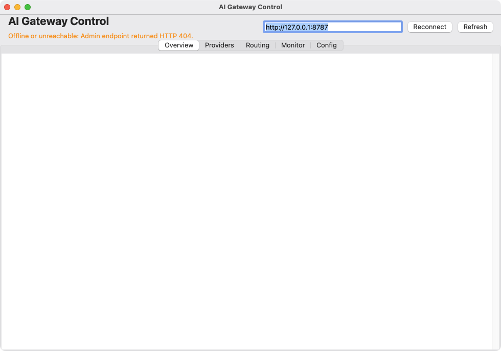

# AI Venture Studio

**15 free macOS apps. Built autonomously, one every morning.**

Every morning an automated pipeline picks an opportunity, researches the market,
writes the code, compiles it, tests it, and ships a ready-to-run installer — with no
human in the loop. These are the results. All free, no signup, no tracking.

[**Browse all 15 apps with screenshots →**](https://kdylan1010-alt.github.io/venture-studio-portfolio/)

<p align="center">
  <a href="https://kdylan1010-alt.github.io/venture-studio-portfolio/v/airgap-redaction-workbench.html"></a>
  <br><sub><i>AirgapRedactionWorkbench — one of 15 tools below</i></sub>
</p>

---

## Download

| App | What it does | Get it |
|---|---|---|
| **[Vendor1099Copilot](https://kdylan1010-alt.github.io/venture-studio-portfolio/v/vendor-1099-copilot.html)** | Vendor 1099 Threshold Copilot: a native macOS desktop app for SMB owners, bookkeepers, and… | [⬇ Download](https://github.com/kdylan1010-alt/venture-studio-portfolio/releases/download/vendor-1099-copilot/Vendor1099Copilot.dmg) <br><sub>675 KB</sub> |
| **[EvidencePack](https://kdylan1010-alt.github.io/venture-studio-portfolio/v/accessibility-evidence-pack.html)** | Accessibility Evidence Pack for SaaS teams, agencies, and digital product owners shipping into… | [⬇ Download](https://github.com/kdylan1010-alt/venture-studio-portfolio/releases/download/accessibility-evidence-pack/EvidencePack.dmg) <br><sub>692 KB</sub> |
| **[AirgapRedactionWorkbench](https://kdylan1010-alt.github.io/venture-studio-portfolio/v/airgap-redaction-workbench.html)** | Air-gapped Redaction Workbench: target users are law firms, compliance teams, journalists, and… | [⬇ Download](https://github.com/kdylan1010-alt/venture-studio-portfolio/releases/download/airgap-redaction-workbench/AirgapRedactionWorkbench.dmg) <br><sub>302 KB</sub> |
| **[ContractDriftFinder](https://kdylan1010-alt.github.io/venture-studio-portfolio/v/contract-drift-finder.html)** | A native macOS app for SMB owners, ops managers, and freelancers that opens PDFs locally,… | [⬇ Download](https://github.com/kdylan1010-alt/venture-studio-portfolio/releases/download/contract-drift-finder/ContractDriftFinder.dmg) <br><sub>309 KB</sub> |
| **[DownloadTriageAssistant](https://kdylan1010-alt.github.io/venture-studio-portfolio/v/download-triage-assistant.html)** | A native macOS desktop utility for security-conscious users, consultants, and IT admins that… | [⬇ Download](https://github.com/kdylan1010-alt/venture-studio-portfolio/releases/download/download-triage-assistant/DownloadTriageAssistant.dmg) <br><sub>293 KB</sub> |
| **[EInvoiceWorkbench](https://kdylan1010-alt.github.io/venture-studio-portfolio/v/einvoice-workbench.html)** |  | [⬇ Download](https://github.com/kdylan1010-alt/venture-studio-portfolio/releases/download/einvoice-workbench/EInvoiceWorkbench.dmg) <br><sub>302 KB</sub> |
| **[BidTriage](https://kdylan1010-alt.github.io/venture-studio-portfolio/v/local-rfp-triage.html)** | Local RFP/Bid Triage Assistant for small contractors: target users are small… | [⬇ Download](https://github.com/kdylan1010-alt/venture-studio-portfolio/releases/download/local-rfp-triage/BidTriage.dmg) <br><sub>264 KB</sub> |
| **[LocalSecretsPIISweeper](https://kdylan1010-alt.github.io/venture-studio-portfolio/v/local-secrets-pii-sweeper.html)** | A privacy-first native macOS utility for consultants, agencies, and small businesses that scans… | [⬇ Download](https://github.com/kdylan1010-alt/venture-studio-portfolio/releases/download/local-secrets-pii-sweeper/LocalSecretsPIISweeper.dmg) <br><sub>664 KB</sub> |
| **[MacSecretSweep](https://kdylan1010-alt.github.io/venture-studio-portfolio/v/mac-secret-sweep.html)** |  | [⬇ Download](https://github.com/kdylan1010-alt/venture-studio-portfolio/releases/download/mac-secret-sweep/MacSecretSweep.dmg) <br><sub>331 KB</sub> |
| **[TaxGapScout](https://kdylan1010-alt.github.io/venture-studio-portfolio/v/offline-tax-gap-scanner.html)** | A local-only macOS desktop app for freelancers and microbusinesses that scans receipts, bank… | [⬇ Download](https://github.com/kdylan1010-alt/venture-studio-portfolio/releases/download/offline-tax-gap-scanner/TaxGapScout.dmg) <br><sub>300 KB</sub> |
| **[PolicyDriftRadar](https://kdylan1010-alt.github.io/venture-studio-portfolio/v/policy-drift-radar.html)** |  | [⬇ Download](https://github.com/kdylan1010-alt/venture-studio-portfolio/releases/download/policy-drift-radar/PolicyDriftRadar.dmg) <br><sub>400 KB</sub> |
| **[PriorAuthAppealDesk](https://kdylan1010-alt.github.io/venture-studio-portfolio/v/prior-auth-appeal-desk.html)** |  | [⬇ Download](https://github.com/kdylan1010-alt/venture-studio-portfolio/releases/download/prior-auth-appeal-desk/PriorAuthAppealDesk.dmg) <br><sub>400 KB</sub> |
| **[ProcurementPulse](https://kdylan1010-alt.github.io/venture-studio-portfolio/v/procurement-pulse-desktop.html)** | Procurement Pulse for small contractors, estimators, and boutique firms that lose revenue when… | [⬇ Download](https://github.com/kdylan1010-alt/venture-studio-portfolio/releases/download/procurement-pulse-desktop/ProcurementPulse.dmg) <br><sub>675 KB</sub> |
| **[ReceiptSentinel](https://kdylan1010-alt.github.io/venture-studio-portfolio/v/receipt-sentinel.html)** | Receipt Sentinel: a native macOS app for freelancers, contractors, and very small businesses… | [⬇ Download](https://github.com/kdylan1010-alt/venture-studio-portfolio/releases/download/receipt-sentinel/ReceiptSentinel.dmg) <br><sub>322 KB</sub> |
| **[DepositPacket](https://kdylan1010-alt.github.io/venture-studio-portfolio/v/tenant-deposit-dispute-packet.html)** | A local macOS app for renters moving out that turns move-in photos, receipts, inspection notes,… | [⬇ Download](https://github.com/kdylan1010-alt/venture-studio-portfolio/releases/download/tenant-deposit-dispute-packet/DepositPacket.dmg) <br><sub>299 KB</sub> |

<sub>15 apps · 6.1 MB total · macOS 12+</sub>

---

## First launch: macOS will ask you to confirm

These apps are **ad-hoc signed but not notarized**. Apple charges $99/year for a
Developer ID certificate and these are free, so macOS asks you to confirm the
first launch. You do this once per app.

**macOS 15 Sequoia and later**

> Try to open the app once and let macOS refuse. Then open
> **System Settings → Privacy & Security**, scroll to the message naming the app,
> and click **Open Anyway**.
>
> (Control-clicking the app no longer works on these versions of macOS.)

**macOS 14 Sonoma and earlier**

> **Control-click** the app → **Open** → **Open** again in the dialog.

We deliberately do not suggest stripping the quarantine flag from the command
line. That is a real technique used to distribute malware, and you should be
suspicious of any download that asks you to do it — including ours.

---

## How these get made

```
scan opportunities → score on 8 axes → research market → write spec
      → build → verify → independent review → package → publish
```

Each app is chosen by scoring candidates 1–10 across eight competing perspectives
— profit, change, effort, viability, future, market, population, availability —
and picking the best *balance*, not the best single score. The per-app pages show
that scoring, the market research, and the review that approved it.

[**See the full record for every app →**](https://kdylan1010-alt.github.io/venture-studio-portfolio/)
