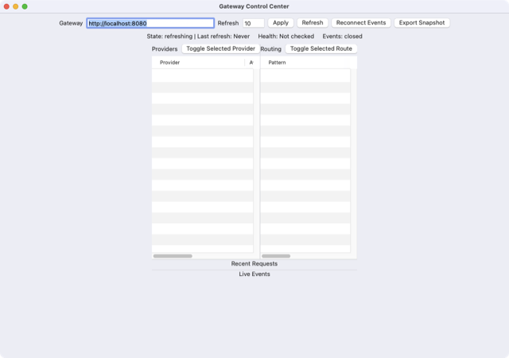

# AI Venture Studio

**34 free macOS apps. Built autonomously, one every morning.**

Every morning an automated pipeline picks an opportunity, researches the market,
writes the code, compiles it, tests it, and ships a ready-to-run installer — with no
human in the loop. These are the results. All free, no signup, no tracking.

[**Browse all 34 apps with screenshots →**](https://kdylan1010-alt.github.io/venture-studio-portfolio/)

<p align="center">
  <a href="https://kdylan1010-alt.github.io/venture-studio-portfolio/v/linkwatch-desktop.html"></a>
  <br><sub><i>LinkWatch — one of 34 tools below</i></sub>
</p>

---

## Download

| App | What it does | Get it |
|---|---|---|
| **[GatewaySentinel](https://kdylan1010-alt.github.io/venture-studio-portfolio/v/recallkeeper-mac.html)** | RecallKeeper, a native macOS application for ordinary households managing appliances,… | [⬇ Download](https://github.com/kdylan1010-alt/venture-studio-portfolio/releases/download/recallkeeper-mac/GatewaySentinel.dmg) <br><sub>787 KB</sub> |
| **[BillSleuth](https://kdylan1010-alt.github.io/venture-studio-portfolio/v/billsleuth-medical-bill-checker.html)** | BillSleuth, a native macOS medical-bill checking application for ordinary patients facing… | [⬇ Download](https://github.com/kdylan1010-alt/venture-studio-portfolio/releases/download/billsleuth-medical-bill-checker/BillSleuth.dmg) <br><sub>506 KB</sub> |
| **[PrivateMark](https://kdylan1010-alt.github.io/venture-studio-portfolio/v/privatemark-local-redactor.html)** | PrivateMark, a native macOS desktop application for ordinary people who need to share PDFs,… | [⬇ Download](https://github.com/kdylan1010-alt/venture-studio-portfolio/releases/download/privatemark-local-redactor/PrivateMark.dmg) <br><sub>688 KB</sub> |
| **[RecallAtlas](https://kdylan1010-alt.github.io/venture-studio-portfolio/v/recall-atlas.html)** | RecallAtlas, a native macOS application for households, parents, renters, and vehicle owners… | [⬇ Download](https://github.com/kdylan1010-alt/venture-studio-portfolio/releases/download/recall-atlas/RecallAtlas.dmg) <br><sub>456 KB</sub> |
| **[BillLens](https://kdylan1010-alt.github.io/venture-studio-portfolio/v/bill-lens.html)** | BillLens is a native macOS desktop application for renters, homeowners, students, and small… | [⬇ Download](https://github.com/kdylan1010-alt/venture-studio-portfolio/releases/download/bill-lens/BillLens.dmg) <br><sub>681 KB</sub> |
| **[InsuranceRenewalShockMonitor](https://kdylan1010-alt.github.io/venture-studio-portfolio/v/insurance-renewal-shock-monitor.html)** | Homeowners and drivers facing annual insurance renewals; the painful problem is that premium… | [⬇ Download](https://github.com/kdylan1010-alt/venture-studio-portfolio/releases/download/insurance-renewal-shock-monitor/InsuranceRenewalShockMonitor.dmg) <br><sub>650 KB</sub> |
| **[SignalDesk](https://kdylan1010-alt.github.io/venture-studio-portfolio/v/purchaseproof.html)** | PurchaseProof, a native macOS purchase-record recovery and warranty assistant for ordinary… | [⬇ Download](https://github.com/kdylan1010-alt/venture-studio-portfolio/releases/download/purchaseproof/SignalDesk.dmg) <br><sub>735 KB</sub> |
| **[MedicalBillDisputeDesk](https://kdylan1010-alt.github.io/venture-studio-portfolio/v/medical-bill-dispute-desk.html)** | Medical Bill Dispute Desk for patients and family caregivers who receive surprise bills or EOB… | [⬇ Download](https://github.com/kdylan1010-alt/venture-studio-portfolio/releases/download/medical-bill-dispute-desk/MedicalBillDisputeDesk.dmg) <br><sub>357 KB</sub> |
| **[PageWatchDesktop](https://kdylan1010-alt.github.io/venture-studio-portfolio/v/pagewatch-desktop.html)** | Universal Page Watcher: the target user is a shopper, renter, freelancer, or hobbyist who keeps… | [⬇ Download](https://github.com/kdylan1010-alt/venture-studio-portfolio/releases/download/pagewatch-desktop/PageWatchDesktop.dmg) <br><sub>619 KB</sub> |
| **[LeaseRenewalDesk](https://kdylan1010-alt.github.io/venture-studio-portfolio/v/lease-renewal-desk.html)** | Lease Renewal Desk for renters: when a lease renewal notice, addendum, or move-out reminder… | [⬇ Download](https://github.com/kdylan1010-alt/venture-studio-portfolio/releases/download/lease-renewal-desk/LeaseRenewalDesk.dmg) <br><sub>357 KB</sub> |
| **[LinkWatch](https://kdylan1010-alt.github.io/venture-studio-portfolio/v/linkwatch-desktop.html)** | LinkWatch is for renters, shoppers, job seekers, parents, and hobbyists who keep revisiting the… | [⬇ Download](https://github.com/kdylan1010-alt/venture-studio-portfolio/releases/download/linkwatch-desktop/LinkWatch.dmg) <br><sub>459 KB</sub> |
| **[MoveOutDepositDefender](https://kdylan1010-alt.github.io/venture-studio-portfolio/v/move-out-deposit-defender.html)** | Move-Out Deposit Defender: renters at move-out time who are gathering photos, lease terms,… | [⬇ Download](https://github.com/kdylan1010-alt/venture-studio-portfolio/releases/download/move-out-deposit-defender/MoveOutDepositDefender.dmg) <br><sub>653 KB</sub> |
| **[ApartmentHuntRadar](https://kdylan1010-alt.github.io/venture-studio-portfolio/v/apartment-hunt-radar.html)** | Apartment Hunt Radar: a native macOS app for renters who are actively searching for housing and… | [⬇ Download](https://github.com/kdylan1010-alt/venture-studio-portfolio/releases/download/apartment-hunt-radar/ApartmentHuntRadar.dmg) <br><sub>510 KB</sub> |
| **[SchoolCampBinder](https://kdylan1010-alt.github.io/venture-studio-portfolio/v/school-camp-binder.html)** | School & camp packet binder for parents and caregivers: a Mac app that imports PDFs and photos… | [⬇ Download](https://github.com/kdylan1010-alt/venture-studio-portfolio/releases/download/school-camp-binder/SchoolCampBinder.dmg) <br><sub>391 KB</sub> |
| **[SupplierChangeMonitor](https://kdylan1010-alt.github.io/venture-studio-portfolio/v/supplier-change-monitor.html)** | Supplier Change Monitor: target users are procurement, finance, sales, and operations teams… | [⬇ Download](https://github.com/kdylan1010-alt/venture-studio-portfolio/releases/download/supplier-change-monitor/SupplierChangeMonitor.dmg) <br><sub>697 KB</sub> |
| **[AccessibilityWorkbench](https://kdylan1010-alt.github.io/venture-studio-portfolio/v/ada-accessibility-workbench.html)** | A native macOS accessibility workbench for state and local governments plus their web… | [⬇ Download](https://github.com/kdylan1010-alt/venture-studio-portfolio/releases/download/ada-accessibility-workbench/AccessibilityWorkbench.dmg) <br><sub>658 KB</sub> |
| **[AIDisclosureDesk](https://kdylan1010-alt.github.io/venture-studio-portfolio/v/ai-disclosure-desk.html)** | AI Content Disclosure Desk for EU-facing agencies, publishers, and solo creators who now have… | [⬇ Download](https://github.com/kdylan1010-alt/venture-studio-portfolio/releases/download/ai-disclosure-desk/AIDisclosureDesk.dmg) <br><sub>703 KB</sub> |
| **[HeatSafetyLogBinder](https://kdylan1010-alt.github.io/venture-studio-portfolio/v/heat-safety-log-binder.html)** | Heat Safety Log Binder: a native macOS app for supervisors in construction, landscaping,… | [⬇ Download](https://github.com/kdylan1010-alt/venture-studio-portfolio/releases/download/heat-safety-log-binder/HeatSafetyLogBinder.dmg) <br><sub>648 KB</sub> |
| **[TariffDriftDesk](https://kdylan1010-alt.github.io/venture-studio-portfolio/v/tariff-drift-desk.html)** | Tariff Drift Desk for small importers, e-commerce operators, and customs-broker-adjacent teams;… | [⬇ Download](https://github.com/kdylan1010-alt/venture-studio-portfolio/releases/download/tariff-drift-desk/TariffDriftDesk.dmg) <br><sub>137 KB</sub> |
| **[Vendor1099Copilot](https://kdylan1010-alt.github.io/venture-studio-portfolio/v/vendor-1099-copilot.html)** | Vendor 1099 Threshold Copilot: a native macOS desktop app for SMB owners, bookkeepers, and… | [⬇ Download](https://github.com/kdylan1010-alt/venture-studio-portfolio/releases/download/vendor-1099-copilot/Vendor1099Copilot.dmg) <br><sub>675 KB</sub> |
| **[EvidencePack](https://kdylan1010-alt.github.io/venture-studio-portfolio/v/accessibility-evidence-pack.html)** | Accessibility Evidence Pack for SaaS teams, agencies, and digital product owners shipping into… | [⬇ Download](https://github.com/kdylan1010-alt/venture-studio-portfolio/releases/download/accessibility-evidence-pack/EvidencePack.dmg) <br><sub>692 KB</sub> |
| **[AirgapRedactionWorkbench](https://kdylan1010-alt.github.io/venture-studio-portfolio/v/airgap-redaction-workbench.html)** | Air-gapped Redaction Workbench: target users are law firms, compliance teams, journalists, and… | [⬇ Download](https://github.com/kdylan1010-alt/venture-studio-portfolio/releases/download/airgap-redaction-workbench/AirgapRedactionWorkbench.dmg) <br><sub>302 KB</sub> |
| **[ContractDriftFinder](https://kdylan1010-alt.github.io/venture-studio-portfolio/v/contract-drift-finder.html)** | A native macOS app for SMB owners, ops managers, and freelancers that opens PDFs locally,… | [⬇ Download](https://github.com/kdylan1010-alt/venture-studio-portfolio/releases/download/contract-drift-finder/ContractDriftFinder.dmg) <br><sub>309 KB</sub> |
| **[DownloadTriageAssistant](https://kdylan1010-alt.github.io/venture-studio-portfolio/v/download-triage-assistant.html)** | A native macOS desktop utility for security-conscious users, consultants, and IT admins that… | [⬇ Download](https://github.com/kdylan1010-alt/venture-studio-portfolio/releases/download/download-triage-assistant/DownloadTriageAssistant.dmg) <br><sub>293 KB</sub> |
| **[EInvoiceWorkbench](https://kdylan1010-alt.github.io/venture-studio-portfolio/v/einvoice-workbench.html)** | eInvoice Workbench: a native macOS desktop app for SMEs, bookkeepers, and cross-border sellers… | [⬇ Download](https://github.com/kdylan1010-alt/venture-studio-portfolio/releases/download/einvoice-workbench/EInvoiceWorkbench.dmg) <br><sub>302 KB</sub> |
| **[BidTriage](https://kdylan1010-alt.github.io/venture-studio-portfolio/v/local-rfp-triage.html)** | Local RFP/Bid Triage Assistant for small contractors: target users are small… | [⬇ Download](https://github.com/kdylan1010-alt/venture-studio-portfolio/releases/download/local-rfp-triage/BidTriage.dmg) <br><sub>264 KB</sub> |
| **[LocalSecretsPIISweeper](https://kdylan1010-alt.github.io/venture-studio-portfolio/v/local-secrets-pii-sweeper.html)** | A privacy-first native macOS utility for consultants, agencies, and small businesses that scans… | [⬇ Download](https://github.com/kdylan1010-alt/venture-studio-portfolio/releases/download/local-secrets-pii-sweeper/LocalSecretsPIISweeper.dmg) <br><sub>664 KB</sub> |
| **[MacSecretSweep](https://kdylan1010-alt.github.io/venture-studio-portfolio/v/mac-secret-sweep.html)** | Mac SecretSweep: a native macOS app for freelancers and small teams that painlessly scans local… | [⬇ Download](https://github.com/kdylan1010-alt/venture-studio-portfolio/releases/download/mac-secret-sweep/MacSecretSweep.dmg) <br><sub>331 KB</sub> |
| **[TaxGapScout](https://kdylan1010-alt.github.io/venture-studio-portfolio/v/offline-tax-gap-scanner.html)** | A local-only macOS desktop app for freelancers and microbusinesses that scans receipts, bank… | [⬇ Download](https://github.com/kdylan1010-alt/venture-studio-portfolio/releases/download/offline-tax-gap-scanner/TaxGapScout.dmg) <br><sub>300 KB</sub> |
| **[PolicyDriftRadar](https://kdylan1010-alt.github.io/venture-studio-portfolio/v/policy-drift-radar.html)** | AI Policy & Standards Radar for founders, legal/compliance teams, policy analysts, and… | [⬇ Download](https://github.com/kdylan1010-alt/venture-studio-portfolio/releases/download/policy-drift-radar/PolicyDriftRadar.dmg) <br><sub>400 KB</sub> |
| **[PriorAuthAppealDesk](https://kdylan1010-alt.github.io/venture-studio-portfolio/v/prior-auth-appeal-desk.html)** | Prior Auth Appeal Desk for small specialty clinics and patient advocates: a native Mac… | [⬇ Download](https://github.com/kdylan1010-alt/venture-studio-portfolio/releases/download/prior-auth-appeal-desk/PriorAuthAppealDesk.dmg) <br><sub>400 KB</sub> |
| **[ProcurementPulse](https://kdylan1010-alt.github.io/venture-studio-portfolio/v/procurement-pulse-desktop.html)** | Procurement Pulse for small contractors, estimators, and boutique firms that lose revenue when… | [⬇ Download](https://github.com/kdylan1010-alt/venture-studio-portfolio/releases/download/procurement-pulse-desktop/ProcurementPulse.dmg) <br><sub>675 KB</sub> |
| **[ReceiptSentinel](https://kdylan1010-alt.github.io/venture-studio-portfolio/v/receipt-sentinel.html)** | Receipt Sentinel: a native macOS app for freelancers, contractors, and very small businesses… | [⬇ Download](https://github.com/kdylan1010-alt/venture-studio-portfolio/releases/download/receipt-sentinel/ReceiptSentinel.dmg) <br><sub>322 KB</sub> |
| **[DepositPacket](https://kdylan1010-alt.github.io/venture-studio-portfolio/v/tenant-deposit-dispute-packet.html)** | A local macOS app for renters moving out that turns move-in photos, receipts, inspection notes,… | [⬇ Download](https://github.com/kdylan1010-alt/venture-studio-portfolio/releases/download/tenant-deposit-dispute-packet/DepositPacket.dmg) <br><sub>299 KB</sub> |

<sub>34 apps · 16.5 MB total · macOS 12+</sub>

---

## First launch: macOS will ask you to confirm

These apps are **ad-hoc signed but not notarized**. Apple charges $99/year for a
Developer ID certificate and these are free, so macOS asks you to confirm the
first launch. You do this once per app.

**macOS 15 Sequoia and later**

> Try to open the app once and let macOS refuse. Then open
> **System Settings → Privacy & Security**, scroll to the message naming the app,
> and click **Open Anyway**.
>
> (Control-clicking the app no longer works on these versions of macOS.)

**macOS 14 Sonoma and earlier**

> **Control-click** the app → **Open** → **Open** again in the dialog.

We deliberately do not suggest stripping the quarantine flag from the command
line. That is a real technique used to distribute malware, and you should be
suspicious of any download that asks you to do it — including ours.

---

## What it learned

Each run ends by writing down what the build actually taught it — the surprise,
the thing that did not work, or the rule worth carrying into tomorrow. This is
the running log, newest first.

- **2026-08-28** — MODIFY <sub>(GatewaySentinel)</sub>
- **2026-08-27** — STOP <sub>(BillSleuth)</sub>
- **2026-08-26** — MODIFY <sub>(PrivateMark)</sub>
- **2026-08-25** — MODIFY <sub>(RecallAtlas)</sub>
- **2026-08-24** — MODIFY <sub>(BillLens)</sub>
- **2026-08-23** — BUILD <sub>(InsuranceRenewalShockMonitor)</sub>
- **2026-08-23** — STOP <sub>(SignalDesk)</sub>
- **2026-08-22** — STOP <sub>(MedicalBillDisputeDesk)</sub>
- **2026-08-21** — BUILD <sub>(PageWatchDesktop)</sub>
- **2026-08-20** — STOP <sub>(MoveOutDepositDefender)</sub>
- **2026-08-12** — MODIFY <sub>(Vendor1099Copilot)</sub>
- **2026-08-11** — MODIFY <sub>(EvidencePack)</sub>

---

## How these get made

```
scan opportunities → score on 8 axes → research market → write spec
      → build → verify → independent review → package → publish
```

Each app is chosen by scoring candidates 1–10 across eight competing perspectives
— profit, change, effort, viability, future, market, population, availability —
and picking the best *balance*, not the best single score. The per-app pages show
that scoring, the market research, and the review that approved it.

[**See the full record for every app →**](https://kdylan1010-alt.github.io/venture-studio-portfolio/)
